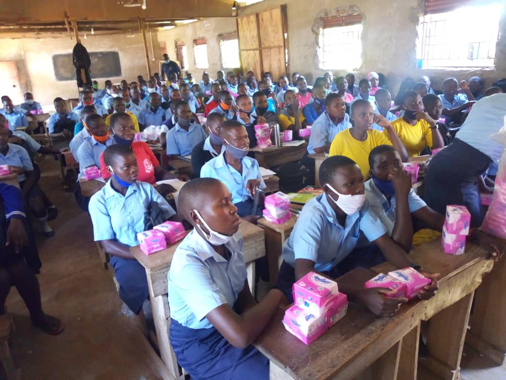

# Ending Period Poverty in Eastern Uganda 

## Project outline 

In Eastern Uganda, many women and schoolgirls use disposable sanitary products. However, many experience months where they cannot afford such products at all. This leaves them in sensitive "period poverty" situations which are difficult to communicate to friends, family, and colleagues. 

My contacts in the area have identified 3 villages that could benefit from:

1. Training and equipment necessary for manufacturing *washable* sanitary towels.

2. A school-based reproductive health training scheme

The washable towels are ideally suited to rural areas as they rely less heavily on imports.

The international development charity Knofu (the Uganda branch of [Knowledge Facilitators International](https://knowledgefacilitators.org), formerly known as Knofacic) will be implementing the project for me. They have started recruiting community members in each of the 3 schools to lead the project.

We believe that (by the grace of God) we will be able to directly impact the lives of 500 girls, and move towards ending period poverty in Uganda.

## Fundraising 

I've created a [new GoFundMe page](https://gofundme.com/f/end-period-poverty-in-eastern-uganda) for handling donations.

100% of the funds raised will be used to employ local charity workers, and to purchase materials.
<footer>I absorb overheads (debit and credit card transaction fees) myself using a separate bank account. Please <a href="#contact">email me</a> if you'd like to contribute to this fund.</footer>

I'll post details and photos here as usual. 

## Pilot session

<figure>
<figcaption>The pilot training session in Peta village</figcaption></figure>

Knofu employees ran a pilot training session in the school in Peta in January 2021. This was financed using leftover funds from the "House for John" sub-project.

The session was a huge success, with male community members commenting "i will definitely help my family members when they come to me in need of [sanitary products] in the future". 

Please continue to pray for us and share this page on social media. 

## Contact

Please email me write to me with any questions relating to the project. 

Tim Wiles  
7 Walnut Close  
Pewsey  
England, UK 
SN95 5QS

Tcwiles@gmail.com 
+447791 355 394

If you have any questions about the work of Knowledge Facilitators International, please use the contact details on [their website](https://knowledgefacilitators.org).

[&lt; Back to the home page](../README.md)
